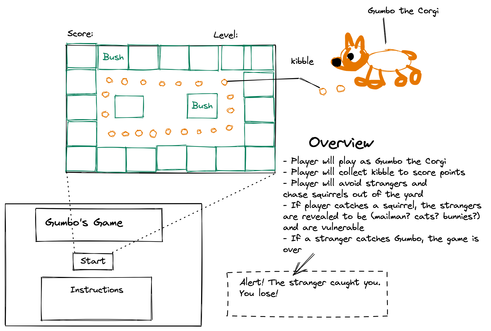

# Gumbo's Game
## A Corgi Adventure Game (GA SEIRFX 621 Project 1)
> ## Introduction
> This first project had the following parameters:
>  - must display a game in the browser
>  - switch turns between two players or have player compete against the computer (obstacles)
>  - design logic for winning and display results on screen
>  - include separate html / css/ js files
>  - use JavaScript for DOM manipulation
>  - the game must be deployed online
>  - best practices (KISS, DRY, semantic markup) must be used.

## Wireframe

> ## Inspiration
> 