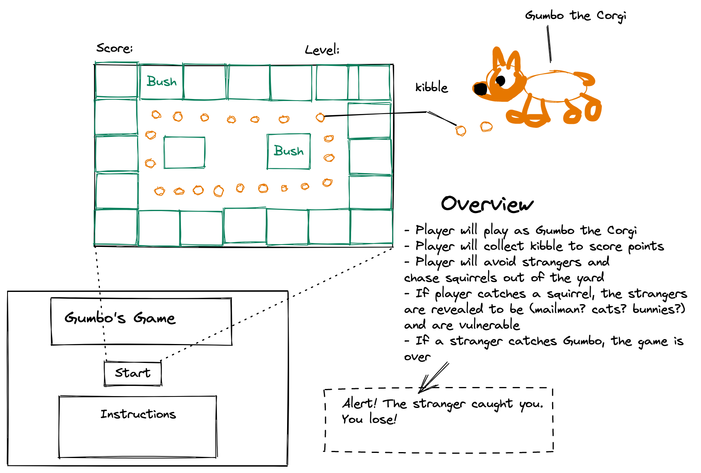
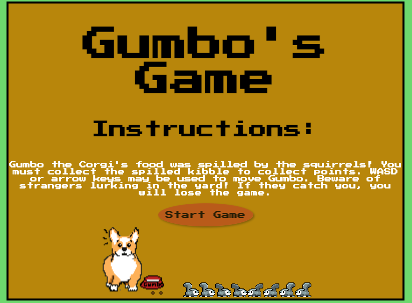
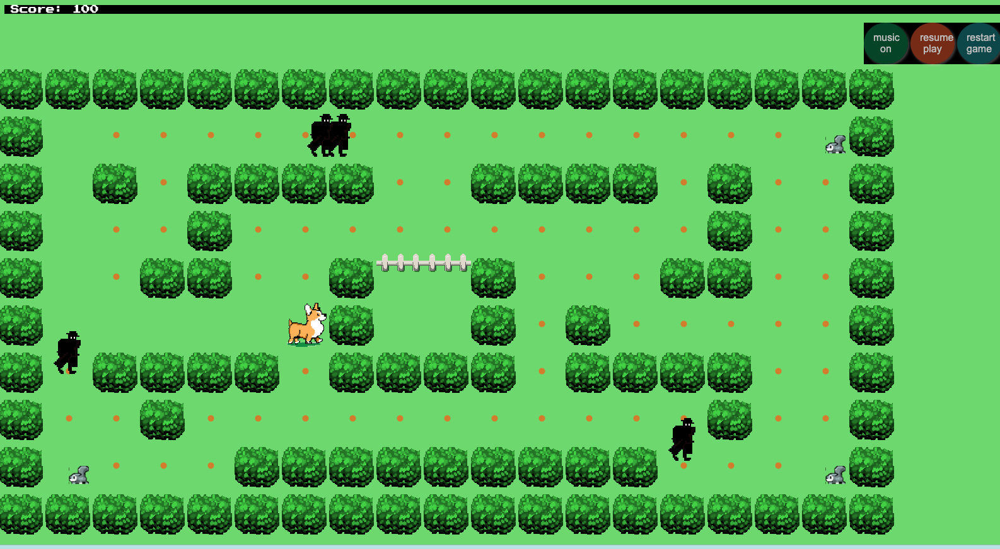

# Gumbo's Game
## A Corgi Adventure Game (GA SEIRFX 621 Project 1)
## Play The Game Here:
[Gumbo's Game](https://catw-m.github.io/gumbosgame_SEIRFX621_project1/)


## Introduction
For the first project, we were given the following parameters:
 - game must display in browser
 - the player must compete against the computer (obstacles)
 - game must include logic for winning and display results on screen
 - separate html / css/ js files must be included
 - JavaScript must be used for DOM manipulation
 - the game must be deployed online  
 - best practices (KISS, DRY, semantic markup) must be used.

## Wireframe
---


## Technologies Used
----
- Javascript (ES6)
- HTML5 with HTML5 audio
- CSS


## Inspiration
---
The day this project was assigned, the world lost a spunky corgi named Gumbo, who passed away unexpectedly. This retro-style game was created in his memory. 


## Features
---
- Start screen with instructions
- Menu within game to restart, pause, and control audio
- Score counter
- PowerSquirrels that allow player to temporarily remove villains from the board
- Win screen when the level is cleared
## Process
---
**Timeframe**

The timeframe on the project was two weeks. The design and code were finished within one week. The additional week was used to improve animation, debug, and add additional features such as sound and game controls.

**Gameboard**

The map generation of the gameboard in HTML5 Canvas allows the developer to easily test or update the level as needed.

The switch statement makes it simple to add additional symbols to the map.
```map.forEach((row, i) => {
  row.forEach((symbol, j) => {
    switch (symbol) {
      case '-':
      boundaries.push(
        new Boundary({
        position: {
          x: j * Boundary.width,
          y: i * Boundary.height
        },
        image: createImage("bushboundary.png")
        })
      )
      break
      case '.':
      pellets.push(
        new Pellets({
        position: {
          x: j * Boundary.width + Boundary.width / 2,
          y: i * Boundary.height + Boundary.height / 2
        }
        })
      )
      break
      case 'f':
        fences.push(
          new Fence({
          position: {
            x: j * Boundary.width,
            y: i * Boundary.height
          },
          image: createImage(`whitefencexaxis.png`)
          })
        )
        break
      case 'p':
      powerSquirrel.push(
        new PowerSquirrel({
        position: {
          x: j * Boundary.width + Boundary.width / 2,
          y: i * Boundary.height + Boundary.height / 2
        },
        image: createImage("squirrel.png")
        })
      )
      break
     
    }
  })
})
```
**Character Movement in the Game**
The movement of the player character, Gumbo, is controlled by event listeners in JavaScript. The player may use either WASD or arrow keys to control Gumbo.

To keep Gumbo in bounds and prevent him from navigating through the obstacles, a function rectangleCollidesWithScare was written. 
```
function rectangleCollidesWithSquare({ rectangle, square }) {
  const padding = 0;
  return (
    (rectangle.position.y + rectangle.velocity.y) <= (square.position.y + square.height + padding) &&
    (rectangle.position.y + rectangle.height + rectangle.velocity.y) >= (square.position.y - padding) &&
    (rectangle.position.x + rectangle.width + rectangle.velocity.x) >= (square.position.x - padding) &&
    (rectangle.position.x + rectangle.velocity.x) <= (square.position.x + square.width + padding)
  );
}
```
Player position and velocity are used to anticipate if a collision will occur based on the position of the boundary/obstacles. If there is overlap, a collision would occur. The padding variable was added to allow for different sized characters in the future.

**Villain Movement**

By far the most challenging aspect of this project was making the villains, aka Strangers, move autonomously within the game. Chris Courses [YouTube PacMan Game Tutorial](https://youtu.be/5IMXpp3rohQ) was a helpful starting point. 

An error in Chris' logic lead to countless headaches and boundless villains. After hours debugging and a few temporary hot-fixes, the villain logic was corrected so that the prevCollisions array was compared to the (current) collisions array before being reset. A default was also added to the conditional statement to prevent "undefined" errors.
```
} else {
        villain.velocity.x = -1 * villain.velocity.x;
        villain.velocity.y = -1 * villain.velocity.y;
      }
      villain.prevCollisions = collisions;
```

## Graphics

With substantial guidance from videos by [Franks laboratory](https://www.youtube.com/c/Frankslaboratory), sprites were added to the game for the player character, villains, and powerSquirrels. 

All sprite sheets and images were created in [Piskel](https://www.piskelapp.com/) with inspiration taken from Google image searches.


**Audio** 

Audio was added to augment user experience. A toggle button was added to the menu to control audio playback. An original composition, "Gumbo's Song", was created specifically for the game and rendered in GarageBand 10.4.5.       

## Screenshots from Game
---




---
